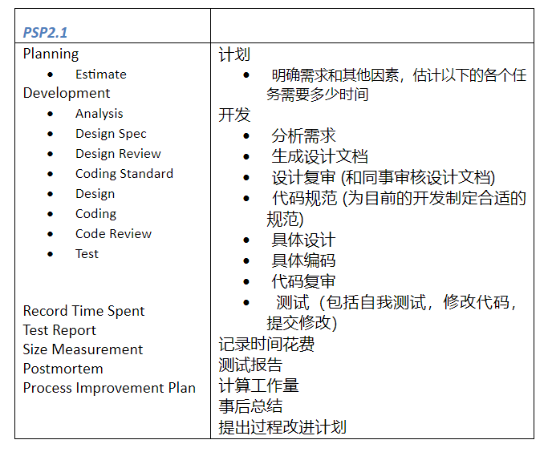

# 系统分析与设计作业一

## 简答题

### **软件工程的定义**

>**Software engineering** is “(1) the application of a _systematic, disciplined, quantifiable_ approach to the _development, operation, and maintenance_ of software, that is, the application of engineering to software,” and “(2) the study of approaches as in (1).” –– IEEE Standard 610.12

### **解释导致 software crisis 本质原因、表现，述说克服软件危机的方法**

>**Software crisis** is a term used in the early days of [computing science](https://en.wikipedia.org/wiki/Computing_science "Computing science") for the difficulty of writing useful and efficient computer programs in the required time. The software crisis was due to the rapid increases in computer power and the complexity of the problems that could not be tackled. With the increase in the complexity of the software, many software problems arose because existing methods were insufficient.

软件危机是计算能力提高而带来的工程复杂度提高，也带来更多软件工程师们无法应对的问题。小创业公司因为项目规划编码时间占了大多数，没有足够时间应对突发困难，最终失败就是一种软件危机。

克服软件危机就要更深入地学习软件周期，进行更合理的规划。

### **软件生命周期**

> 软件生命周期是指软件的产生直到成熟的全部过程。

> 软件生命周期模型是指人们为开发更好的软件而归纳总结的软件生命周期的典型实践参考。

### **SWEBoK 的 15 个知识域（[An Overview of the SWEBOK Guide](https://www.sebokwiki.org/wiki/An_Overview_of_the_SWEBOK_Guide) 请中文翻译其名称与简短说明）**

Software Requirements：软件要求，对于软件要解决的实际问题和功能和可用性的要求。

Software Design：软件设计，根据软件开发周期对每一步骤的设计规划。

Software Construction：软件构建，软件的实现。

Software Testing：软件测试，测试上一步的实现。

Software Maintenance：软件维护，对已完成软件的维护运营。

Software Configuration Management：软件配置管理，对软件的软硬件设施进行的版本等使用规定。

Software Engineering Management：软件工程管理，对软件开发和维护全部过程中步骤的管理。

Software Engineering Process：软件工程过程，软件开发过程。

Software Engineering Models and Methods：软件工程模型和方法，软件开发中用到的技术模型和方法。

Software Quality：软件质量，软件的质量要求。

Software Engineering Professional Practice：软件工程职业实践，对于软件工程中用到的开发技术，交流，报告等技能的要求。

Software Engineering Economics：软件工程经济，软件开发用到的经济成本，需求分析等经济学内容。

Computing Foundations：计算机基础，基础知识。

Mathematical Foundations：数学基础。

Engineering Foundations：工程基础，工程上需要学习的技能。

### **简单解释 CMMI 的五个级别。例如：Level 1 - Initial：无序，自发生产模式。**

Level 1 - Initial：无序，自发生产模式。

Level 2 - Managed：有基本的项目管理。

Level 3 - Defined：开发过程有详细的规范的记录和约束。

Level 4 - Quantitatively Managed：对每一步骤有基于量化分析的管理。

Level 5 - Optimizing：不断优化。

### **用自己语言简述 SWEBok 或 CMMI （约200字）**

软件工程知识体系（SWEBoK）是规范软件工程行业的一种体系（标准）。一共有15条内容，前10条是工程中用到的名称，对于每一个正规的软件工程给项目都需要有这些内容；而后5条是教育方面的内容，软件工程教育需要对从业人员进行这5个内容的培养和训练。掌握这些内容有助于更科学地理解软件工程——从工程的角度而非从理论或理想的角度。

## PSP 2.1

### **阅读[《现代软件工程》](https://www.cnblogs.com/xinz/archive/2011/11/27/2265425.html)的 PSP: Personal Software Process 章节**

### **按表格 PSP 2.1， 了解一个软件工程师在接到一个任务之后要做什么，需要哪些技能，解释你打算如何统计每项数据？ （期末考核，每人按开发阶段提交这个表)**



在《人月神话》中，作者列出了他在软件工程开发中使用的时间表：
* 1/3计划
* 1/6编码
* 1/4构建测试和早期系统测试
* 1/4系统测试，所有的构件已完成

这和psp表的大体结构相似：计划——开发——测试，而其中开发所占的时间比重**往往是最低的**，这与我现在默认的时间规划完全相反。除了编码技能外，规划软件工程项目还需要对每一步的时间有一个大致估计，每一步要准备完整的文档记录；并且编码中也需要需求分析，设计文档，代码规范（可能小项目不需要），代码测试这一系列步骤。

按照表格中的项目，在计划时需要对每一项目预估完成时间，然后在项目进行时对每一阶段进行时间记录，最后完成后与计划进行比对，就可以在下一次计划中进行更精确的时间规划。

最后我把psp2.1表格内容列出如下：

```
计划
* 明确需求和其他因素，估计以下的各个任务需要多少时间

开发
* 分析需求
* 生成设计文档
* 设计复审 (和同事审核设计文档)
* 代码规范 (为目前的开发制定合适的规范)
* 具体设计
* 具体编码
* 代码复审
* 测试（包括自我测试，修改代码，提交修改）

记录时间花费

测试报告

计算工作量

事后总结

提出过程改进计划
```
