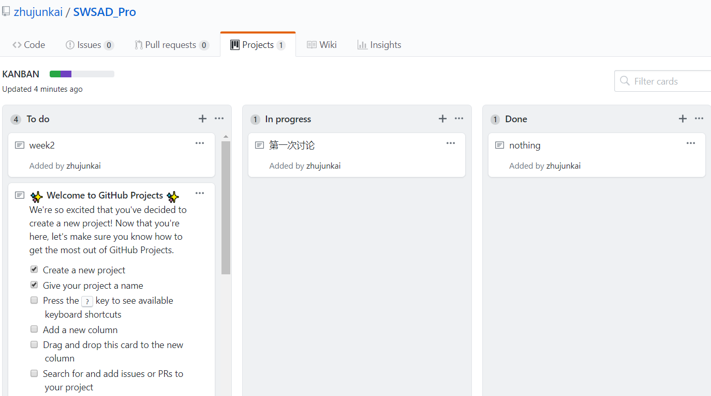
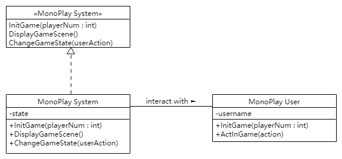

# 系统分析与设计作业二

## 简答题

### **用简短的语言给出对分析、设计的理解**

软件工程分析设计是对软件对象实现的规划，是为了构建更高效更有质量的软件。

### **用一句话描述面向对象的分析与设计的优势**

面向对象的分析与设计能快速且完全地分析出对象的需求。

### **简述 UML（统一建模语言）的作用。考试考哪些图？**

UML可以构建对象的关系图，直观且易于修改，并且面向对象的设计方便应用到编程语言中。

### **从软件本质的角度，解释软件范围（需求）控制的可行性**

软件工程的本质有：complexity 复杂性，conformity 一致性，changeability 可变性，invisibility 不可视性。
因为有了这些特性，需求控制的必要性才凸显出来，但这些特性同时也带来了需求控制极高的难度，但是需求控制仍然是可以实现的。

对于复杂性、可变性和不可视性这三个特性，决定了无法精确地完全地进行开发控制，但是一致性又表明软件工程是有些固定部分的，比如语法规范这样的确定的规则，所以可以从一个范围内，对软件的主要部分进行灵活的控制，规划可见的主要成本和潜在的未知成本。

---

## 项目管理实践

* 看板使用练习（提交看板执行结果贴图，建议使用 Git project）
* 使用截图工具（png格式输出），展现你团队的任务 Kanban
* 每个人的任务是明确的。必须一周后可以看到具体结果
* 每个人的任务是1-2项
* 至少包含一个团队活动任务

---

## UML绘图工具练习（提交贴图，必须使用 UMLet）

* 请在参考书2或教材中选择一个类图（给出参考书页码图号）

因为课本《UML和模式应用》中的UML类图章节没有类图例子，所以我选择了p71的MonoPlay应用中玩家的类构建类图：

